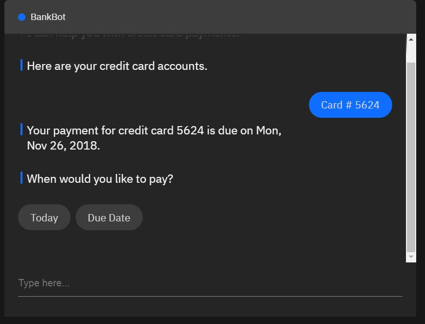
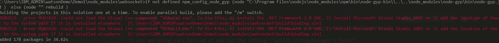
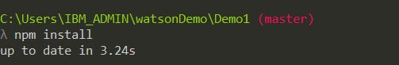

# watsonDemo
watsonApi(Assistant + T2S + S2T + NLC ) + Node.js + React Native

## Target
A ChatBotDemo runing on mobile, with friendly UI, could process
 - Chatting
 - Q&A
 - make a payment
 - Book an Appoinment
 - Recommand life insurance
 - Serach
 - Play media
  
## Reference
[IBM Demo](https://www.ibm.com/watson/ai-assistant/#developers)

## Image

## Using
 - WatsonApi(Assistant + T2S + S2T + NLC)
 - Node.js
 - React Native
 - Restful Api
 - MongoDb
 - Auth

## Guide
 ### 1.Dependencies install: npm install
  - Error1: error MSB3428
    
    Install .NET Framework 2.0 SDK will fix it : (https://www.microsoft.com/en-us/download/confirmation.aspx?id=15354)
    
 ### 2.Run application: node index.js
 ### 3. Coding
 ### 4. Testing at local
 ### 5. Upload source to Bluemix:
  - index.js : update as below
      //app.set('port', process.env.PORT || 6003);
      app.set('port', appEnv.port);
  - send source to cloud foundry: cf target -> cf push

## Referance
  - https://github.com/watson-developer-cloud/assistant-simple
  
## Tip
  - .gitignore file set as below
      node_modules/
      env.json
  - .cfignore
      node_modules/